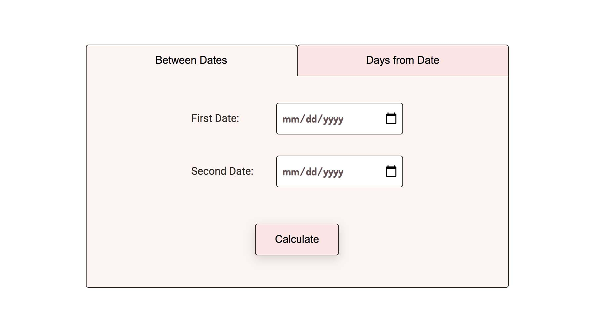

# Time Calculator
[Demo](https://tbm85.github.io/demo-time-calculator/)

## Description
A time calculator made with Next JS

This is a [Next.js](https://nextjs.org/) project bootstrapped with [`create-next-app`](https://github.com/vercel/next.js/tree/canary/packages/create-next-app).

## Resources
* [Dosis Font](https://fonts.google.com/specimen/Dosis)
* [Roboto Font](https://fonts.google.com/specimen/Roboto)

## How to run this app
* Clone: `git clone https://github.com/TBM85/demo-time-calculator.git`
* Enter in the directory: `cd demo-time-calculator`
* Install dependencies: `npm install`
* Start the app: `npm run dev`
* Open in: `http://localhost:3000/demo-time-calculator`

## What can this application do?
* In the first tab, it can calculate the elapsed time in days, between two dates
* In the second tab, you can calculate the resulting date after a certain number of days after the selected date

## License
Copyright (c) 2021 Tania Ballester. This project is using [MIT License](LICENSE.md)